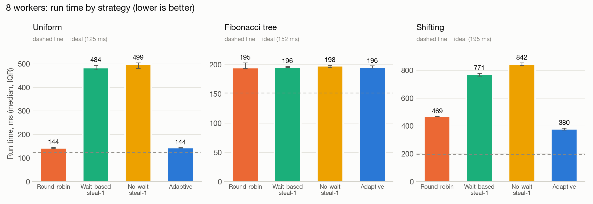
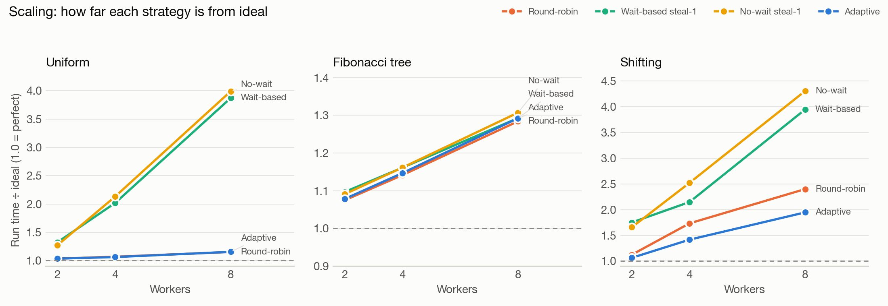
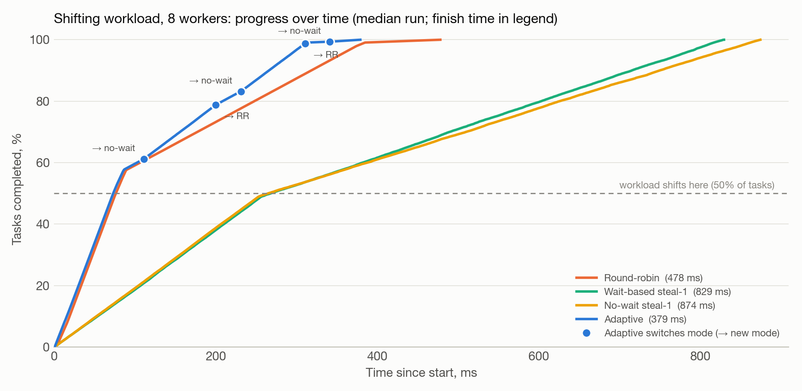
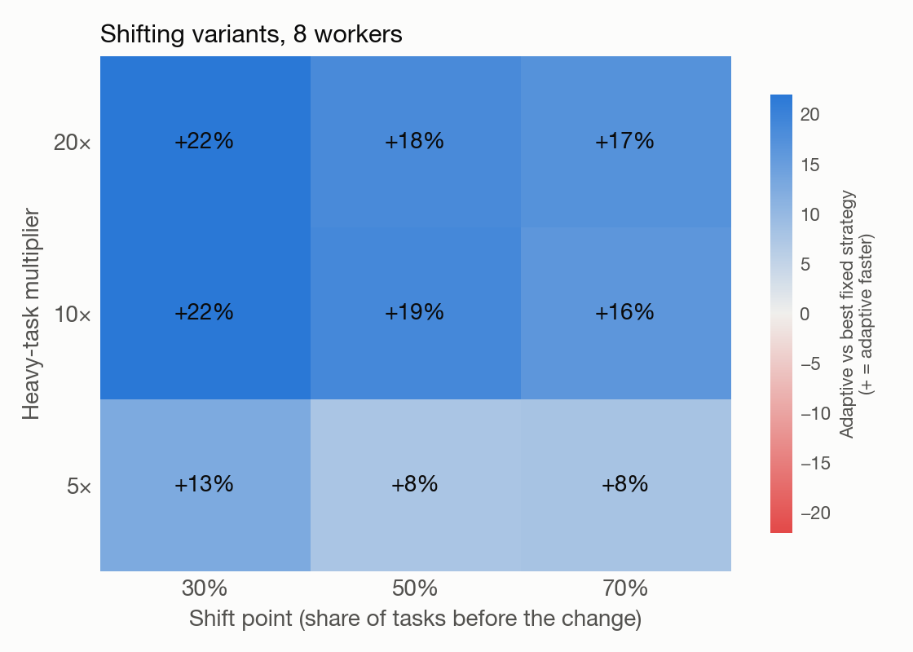

# Lockless Adaptive Scheduler

A lock-free task scheduler written from scratch in Java, the way an operating system would
build one, that **changes its own scheduling strategy while it runs** depending on how
balanced the work currently is.

It reimplements the three scheduling strategies from the **X-OpenMP** paper on per-worker,
single-producer/single-consumer lock-free queues. On top of them, an **adaptive controller**
watches the running system and moves it between strategies at runtime. Normally someone has to
pick one strategy before the program starts and live with that choice.

**Headline result:** on a workload whose shape changes mid-run, the adaptive scheduler is
**18.9% faster than the best fixed strategy at 8 workers** (380 ms against 469 ms), and
faster in all 9 variants of that workload (+8% to +22%). On workloads that don't change shape,
it matches the best fixed strategy to within 1%. Its monitoring cost is not measurable. All
**710 of 710** recorded experiment runs completed with no lost, duplicated or failed task.



---

## Contents

- [The problem](#the-problem)
- [What we built](#what-we-built)
- [How it works](#how-it-works)
- [How correctness is verified](#how-correctness-is-verified)
- [Results](#results)
- [Honest limitations](#honest-limitations)
- [Build and run](#build-and-run)
- [Repository layout](#repository-layout)
- [Documentation](#documentation)

---

## The problem

A parallel program is split into many small tasks, and N worker threads run them. Something
has to decide which worker runs which task. There are two classic approaches:

| | Static round-robin | Work stealing |
|---|---|---|
| **Idea** | Deal tasks out like cards, one per worker in turn | Idle workers take work from busy ones |
| **Cost** | Almost nothing | Workers must coordinate on every steal |
| **Good when** | Tasks are all about the same size | Task sizes vary, or work appears unevenly |
| **Bad when** | A few workers get the big tasks and the rest sit idle | Work is already balanced, so stealing is pure overhead |

The X-OpenMP paper implements both efficiently, and its own results show that **neither wins
everywhere**. The user must choose before running, and if the workload changes shape halfway
through, the system cannot react. That gap is what this project addresses.

## What we built

| Layer | What it does |
|---|---|
| **Lock-free queues** | Every worker owns one queue per producer (X-OpenMP's XQueue layout), so every queue has exactly one producer and one consumer, and no queue needs a lock or a CAS. |
| **Three strategies (from the paper)** | Static round-robin; wait-based stealing (a thief asks and waits briefly for an answer); no-wait stealing (a thief asks and returns to its own queues at once). |
| **Adaptive controller (our contribution)** | A monitor thread samples queue imbalance, idle workers and steal success every 5 ms, and switches strategy while the program runs. Each switch is treated as an experiment that must prove itself. |
| **OS components** | A task control block table (task states such as ready, running, blocked, finished); a resource manager with a wait-for graph and **deadlock detection**; termination detection. |
| **Verification** | 264 unit and integration tests; **jcstress** concurrency tests for the queues, the steal handshake and mode switching; **JMH** benchmarks including Java's `ForkJoinPool` as a baseline. |

About 5,400 lines of main code and 2,000 lines of tests, in 12 Maven modules.

## How it works

### Queues: lock-free by construction

With N workers, worker *j* owns N incoming queues, one per producer *i*. When worker *i* sends
a task to *j*, it writes into the queue that *i* produces and *j* consumes. Because each
queue has a single writer and a single reader, `SpscQueue` needs no CAS. It only needs two
**release/acquire** pairs:

- **The producer writes the slot, then publishes the tail with a release store.** A consumer
  that sees the new tail (acquire) is guaranteed to see the task's contents.
- **The consumer reads the slot, then publishes the head with a release store.** The
  producer never overwrites a slot that is still being read.

X-OpenMP gets this ordering for free from x86's TSO memory model. Java gives no such
guarantee, and our development machines are ARM (Apple Silicon), which reorders memory more
aggressively. So the ordering is spelled out with `VarHandle` access modes, and checked with
jcstress on ARM hardware. The two indices also sit 128 bytes apart (one Apple Silicon cache
line) to avoid false sharing. Full reasoning: [docs/memory-model.md](docs/memory-model.md).

### The worker loop and the strategies

```
loop:
    if the mode flag changed:  old.onExit(); new.onEnter()      // only between tasks
    task = poll my own queues
    if task:   strategy.onDequeue()   // victim side: answer steal requests
               run task
    else:      strategy.onIdle()      // thief side: try to get work
spawn(child):  target = strategy.onSpawn(child); push to target
```

- **Round-robin:** `onSpawn` deals children to workers in rotation. It never steals.
- **Stealing:** children stay on the spawning worker. An idle thief posts a request into the
  victim's **steal-request cell**: one 64-bit word packing a round number and the thief's id,
  changed only by CAS. The *victim* moves tasks into the thief's queue at its own next
  enqueue or dequeue, then answers. **The thief never touches the victim's queues,** so the
  one-producer, one-consumer rule is never broken.

### The adaptive controller

Measurements showed that a rule based purely on signals makes things *worse*. When
round-robin struggles (one worker buried, the rest idle), the signals say "try stealing", but
the paper's steal-1 is slower still in that situation. So the controller runs trials:

1. **Trigger.** Signals suggest the other family of strategy. Workers must be idle while work
   is queued, and the work concentrated (queue imbalance ≥ 2.0). The condition must hold for
   3 samples in a row: this is the hysteresis.
2. **Trial.** Switch, then compare **worker utilization** over the next 6 samples with the 6
   samples before the switch. Utilization (the fraction of workers busy) measures useful
   work regardless of task size.
3. **Verdict.** If utilization dropped by more than 5%, **revert**, and double the wait before
   probing again (exponential backoff, up to 32×). Otherwise **keep** the new mode.

**Why mode switches are safe:** a strategy never holds a task across hook calls. Tasks only
ever move from one queue straight into another, and every mode drains all of a worker's
queues. So a task is always in exactly one queue or owned by exactly one worker, whichever
mode each worker happens to be in.

### OS components

- **Task control blocks:** every task's state moves READY → RUNNING → FINISHED/FAILED by
  CAS. A second claim of the same task would fail the CAS and be counted as a bug. Across all
  runs the count is 0.
- **Termination:** a single counter, incremented when a task is created and decremented when
  it finishes. A child is counted before its parent finishes, so the count can't reach zero
  early.
- **Deadlock detection:** single-instance named resources, plus a wait-for graph. On every
  blocking request, the manager looks for a cycle through the requester (a new cycle must
  include the new edge). The requester is aborted with a `DeadlockException`, and its
  resources are released when its task ends. In the dining-philosophers demo, **7–11 real
  five-way deadlocks per run** were detected and broken, and all 100 meals were still eaten.

## How correctness is verified

| Check | Scope | Result |
|---|---|---|
| Unit and integration tests (JUnit 5) | 264 tests across 10 modules. Exactly-once execution for every strategy × queue type × 1, 2, 8 workers × steal batch; termination (long chains, late bursts, single worker); nonstop strategy switching during runs; forced deadlocks | **264 / 264 pass**; the integration suite was also re-run 20× in a row during Phase 2 without a failure |
| jcstress: `SpscQueue` | No loss or duplication, FIFO order, safe publication of task contents, full-queue boundary | **170 / 170** runs, 0 forbidden outcomes |
| jcstress: steal handshake | Serve vs. withdraw race, two thieves racing for one cell, stolen task visible after the answer | **102 / 102**; the rare "withdrawn mid-serve" race occurred 5,000–32,000× per run |
| jcstress: mode switch | Thief leaves stealing mode while the victim serves; both leave at once | **68 / 68**, about 960 million samples, 0 forbidden outcomes |
| Experiments | Every recorded run is audited for completion, duplicate claims and failures | **710 / 710 clean** |

## Results

All numbers are from [docs/results.md](docs/results.md), which also gives the full method.

**Setup:**
- one Apple Silicon Mac (12 cores: 8 performance, 4 efficiency), JDK 21
- per configuration: **2 discarded warm-up runs + 10 recorded runs**, reported as the
  **median (interquartile range)**
- adaptive thresholds tuned on a *separate* workload, then frozen before the final runs
- 12,500 tasks per worker for the uniform and shifting workloads
- "ideal" = total work ÷ workers, a lower bound no scheduler can beat

**Workloads:**

| Workload | Shape | Who should win |
|---|---|---|
| **Uniform** | 100k equal 10 µs tasks (at 8 workers) | Round-robin |
| **Fibonacci tree** | Naive recursive Fibonacci as tasks: 242,785 tasks of 5 µs, created dynamically and lopsided | Unclear |
| **Shifting** | First half like uniform; second half has every 8th task 10× heavier, which round-robin's rotation sends to a single worker | Changes mid-run |

### Main matrix: run time in ms, median (IQR); lower is better

**Bold** = best fixed strategy. The last column is adaptive's gain over it.

| Workload | Workers | Ideal | Round-robin | Wait steal-1 | No-wait steal-1 | Adaptive | Adaptive vs best fixed |
|---|---|---|---|---|---|---|---|
| Uniform | 2 | 125 | **129 (129–130)** | 165 (162–172) | 159 (152–165) | 129 (129–130) | +0.0% |
| Uniform | 4 | 125 | **133 (132–134)** | 252 (250–257) | 266 (265–269) | 133 (132–134) | +0.6% |
| Uniform | 8 | 125 | **144 (143–146)** | 484 (475–494) | 499 (482–504) | 144 (143–145) | −0.2% |
| Fibonacci | 2 | 143 | **154 (154–154)** | 157 (156–158) | 156 (156–158) | 154 (153–155) | −0.3% |
| Fibonacci | 4 | 188 | **214 (213–216)** | 218 (216–219) | 218 (214–219) | 215 (214–215) | −0.5% |
| Fibonacci | 8 | 152 | **195 (194–203)** | 196 (195–197) | 198 (196–199) | 196 (195–198) | −0.6% |
| **Shifting** | 2 | 406 | **456 (456–458)** | 711 (710–714) | 673 (653–682) | **432 (430–440)** | **+5.4%** |
| **Shifting** | 4 | 266 | **461 (460–461)** | 571 (569–572) | 670 (668–674) | **376 (372–386)** | **+18.3%** |
| **Shifting** | 8 | 195 | **469 (467–470)** | 771 (760–779) | 842 (834–854) | **380 (372–385)** | **+18.9%** |



### What the controller does over time



Through the balanced first half, adaptive follows round-robin. After the shift it moves to
no-wait stealing, briefly probes back to round-robin, finds it worse, and returns. It finishes
at 379 ms against round-robin's 478 ms (median runs).

**Why it beats both fixed strategies:** by the time it switches, round-robin has already
spread most tasks across all eight queues, so thieves have many victims. Stealing then drains
the overloaded worker. Neither fixed strategy does both.

### Sensitivity: does it depend on the workload's exact shape?



| Heavy-task multiplier | Shift at 30% | Shift at 50% | Shift at 70% |
|---|---|---|---|
| 5× | +12.7% | +7.7% | +7.9% |
| 10× | +21.9% | +18.9% | +16.2% |
| 20× | +22.0% | +18.4% | +17.2% |

Adaptive is faster in **all 9** variants. The gain grows with the imbalance (heavier tasks)
and with how much of the run comes after the shift.

### Other measurements

| Measurement | Result |
|---|---|
| **Monitor overhead** (JMH, 8 workers, 50k empty tasks) | 512.5 ns per task without the controller, 513.8 ns with it, within the error bars |
| **Queue throughput** (JMH, one producer and one consumer) | `SpscQueue` about **389 ops/µs** against `LockingQueue` about **19 ops/µs** (about 20×) |
| **Round-robin scaling** (uniform workload, 1→8 workers) | 99% → 97% → 93% → 87% efficiency; **7.0× speedup** at 8 workers |
| **Java `ForkJoinPool`** (same workloads, 8 threads) | Uniform 143 ms, Fibonacci 180 ms, shifting 216 ms |

### Finding: steal granularity

The paper's steal-1 hands over **one task per handshake**. A victim can therefore shed at
most one task for each task it runs itself, and can never drain a backlog quickly. That one
limitation is why the paper's stealing modes lose on our workloads. Handing over half the
victim's queue (steal-half, available as `"stealBatch": "half"`) changes the picture, at 8
workers:

| Workload | No-wait steal-half | Best paper strategy | Adaptive |
|---|---|---|---|
| Uniform | **137 ms** | 144 ms | 144 ms |
| Fibonacci | **189 ms** | 195 ms | 196 ms |
| Shifting | **210 ms** | 469 ms | 380 ms |

We kept the paper's steal-1 as the stealing modes, to stay a faithful reimplementation, and
report steal-half as a separate finding.

## Honest limitations

- **One machine, not idle.** The median load average during the runs was 5.7: the
  experiments' own threads, plus VS Code and Word. Comparisons were interleaved under the
  same conditions, but absolute times will differ on other hardware.
- **Adaptive only helps when the workload changes shape.** On stable workloads it matches the
  best fixed strategy; it does not beat it. On Fibonacci it is 0.3–0.6% slower, the price of
  occasional trial switches.
- **The gain is small with 2 workers** (+5%). An overloaded worker has only one other worker
  to shed load to.
- **Not faster than Java's `ForkJoinPool` or steal-half on shifting.** The controller can
  only choose among the strategies it is given, and the paper's steal-1 is their weak point.
  `ForkJoinPool`'s thieves take work directly from the victim's queue with a CAS, which the
  single-producer, single-consumer design deliberately rules out.
- **Blocking resources block a worker thread.** A task waiting in `acquire` occupies its
  worker. The Banker's algorithm (deadlock avoidance) is not implemented; detection and
  recovery are.
- **Open questions about the paper** (exact steal-1/steal-2 semantics, its task-distribution
  delta formula) are listed in [docs/paper-notes.md](docs/paper-notes.md).

## Build and run

You need **JDK 21+**. The Maven wrapper downloads Maven itself.

```sh
./mvnw verify                        # build everything, run all 264 tests
./mvnw -pl sched-queue -am test      # one module and its dependencies
```

**Run an experiment** (writes `results/<name>/runs.csv` and per-worker CSVs):

```sh
java -jar sched-cli/target/scheduler.jar --config experiments/shifting-adaptive.json
java -jar sched-cli/target/scheduler.jar --config experiments/shifting-adaptive.json --trace  # + traces
java -jar sched-cli/target/scheduler.jar --config experiments/deadlock-demo.json            # deadlock demo
```

Options: `--repeats N`, `--warmup N`, `--queue spsc|locking`, `--timeout-seconds S`, `--out DIR`.

**Reproduce every number in this README:**

```sh
python3 scripts/make_sweep.py                    # generates experiments/tuning and experiments/final
scripts/run_experiments.sh experiments/tuning    # threshold tuning (kept separate)
scripts/run_experiments.sh experiments/final     # 71 configs, 710 recorded runs
scripts/run_traces.sh                            # traces for the over-time chart
python3 scripts/plot_results.py                  # charts + tables → docs/report/figures
```

**Concurrency tests and benchmarks:**

```sh
java -jar sched-stress/target/jcstress.jar -t 'SpscQueueStress|StealHandshakeStress|ModeSwitchStress'
java -jar sched-bench/target/benchmarks.jar StrategyBenchmark    # also: QueueBenchmark,
                                                                 # OverheadBenchmark, ForkJoinBaseline
```

Run experiments on an idle machine: heavy background apps (and jcstress) skew timings. Each
run records its load average in `runs.csv`.

## Repository layout

| Module | Contents |
|---|---|
| `sched-common` | Task model (`Task`, `TaskControlBlock`, `TaskState`), every interface (contract), config |
| `sched-queue` | `SpscQueue` (lock-free), `LockingQueue` (baseline), `WorkerQueueSet` |
| `sched-engine` | `WorkerPool`, `Worker` loop, TCB table, mode flag, termination, signal source |
| `sched-strategies` | `StaticRoundRobin`, `WaitBasedSteal`, `NoWaitSteal`, `StealRequestCell` |
| `sched-adaptive` | `AdaptiveController`, `DecisionRule`, `SignalCollector` |
| `sched-resources` | `DefaultResourceManager`, `AllocationGraph`, `DeadlockDetector` |
| `sched-metrics` | `MetricsRegistry`, `TraceRecorder`, `DeltaCalculator`, `CsvExporter` |
| `sched-workloads` | Uniform, Fibonacci tree, shifting, dining philosophers |
| `sched-cli` | Command-line entry point: runs experiment configs |
| `sched-integration` | End-to-end tests: exactly-once, termination, mode switching, deadlocks |
| `sched-stress` | jcstress tests |
| `sched-bench` | JMH benchmarks and the `ForkJoinPool` baseline |
| `experiments/` | Experiment configs (JSON); `tuning/` and `final/` are generated |
| `scripts/` | Sweep generator, experiment runner, trace runner, chart generator |

**Dependency rules:** strategies, adaptive, resources, metrics and workloads depend only on
`sched-common` (strategies also on `sched-queue`). None of them depends on the engine or on
each other; they communicate only through the interfaces in `sched-common`. `sched-cli`
wires the real implementations together. Nothing depends on cli, integration, bench or
stress.

## Documentation

| Document | What it covers |
|---|---|
| [docs/results.md](docs/results.md) | Full method, all result tables, charts, limitations |
| [docs/architecture.md](docs/architecture.md) | Design of every component, measurements and decisions along the way |
| [docs/memory-model.md](docs/memory-model.md) | Why each fence and access mode is there: x86 TSO compared with the JVM on ARM |
| [docs/contracts-changelog.md](docs/contracts-changelog.md) | Every change to the shared interfaces, and why |
| [docs/paper-notes.md](docs/paper-notes.md) | X-OpenMP notes and open questions about the paper |

Any change to a `sched-common` interface must be logged in the contracts changelog.
