# How the scheduler works: workflow diagrams

This file shows, step by step, what happens when the scheduler runs. Each diagram covers one
part of the system, from the whole run down to a single steal. For the design reasoning
behind each part, see [docs/architecture.md](docs/architecture.md); for measured results, see
[README.md](README.md#results).

1. [The big picture](#1-the-big-picture)
2. [One run, start to finish](#2-one-run-start-to-finish)
3. [How tasks travel: the queue layout](#3-how-tasks-travel-the-queue-layout)
4. [The worker loop](#4-the-worker-loop)
5. [Spawning a task](#5-spawning-a-task)
6. [A task's life (task control block)](#6-a-tasks-life-task-control-block)
7. [Work stealing: the handshake](#7-work-stealing-the-handshake)
8. [The adaptive controller](#8-the-adaptive-controller)
9. [Why switching mid-run is safe](#9-why-switching-mid-run-is-safe)
10. [Deadlock detection](#10-deadlock-detection)
11. [Knowing when everything is done](#11-knowing-when-everything-is-done)
12. [The experiment pipeline](#12-the-experiment-pipeline)

---

## 1. The big picture

The modules and how they depend on each other. Everything talks through the interfaces
(contracts) in `sched-common`; `sched-cli` plugs the real implementations together.

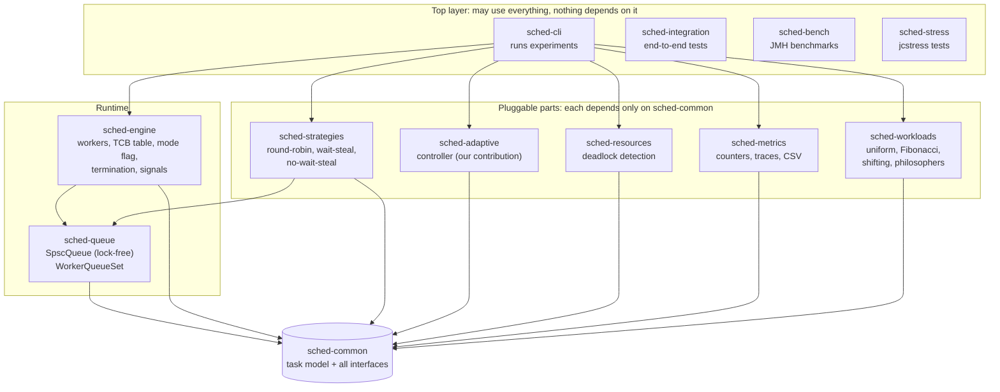

---

## 2. One run, start to finish

What happens between typing the command and getting the CSV files.

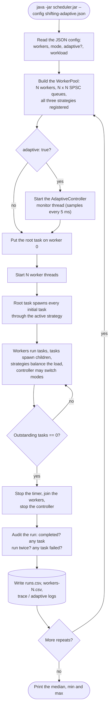

Warm-up runs follow the same path but are not recorded.

---

## 3. How tasks travel: the queue layout

Each worker owns one incoming queue **per producer**, so every queue has exactly one writer
and one reader, and no queue ever needs a lock. Shown for 3 workers:

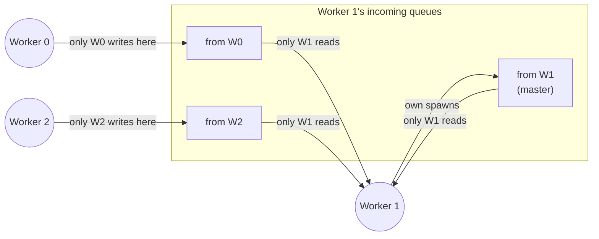

Every worker has the same set. Worker *i* sending a task to worker *j* writes into "*j*'s
queue from *i*". Inside `SpscQueue`, a **release** store when publishing and an **acquire**
load when reading guarantee the reader sees the whole task (see
[docs/memory-model.md](docs/memory-model.md)).

---

## 4. The worker loop

What every worker thread does, over and over, until the run is finished.

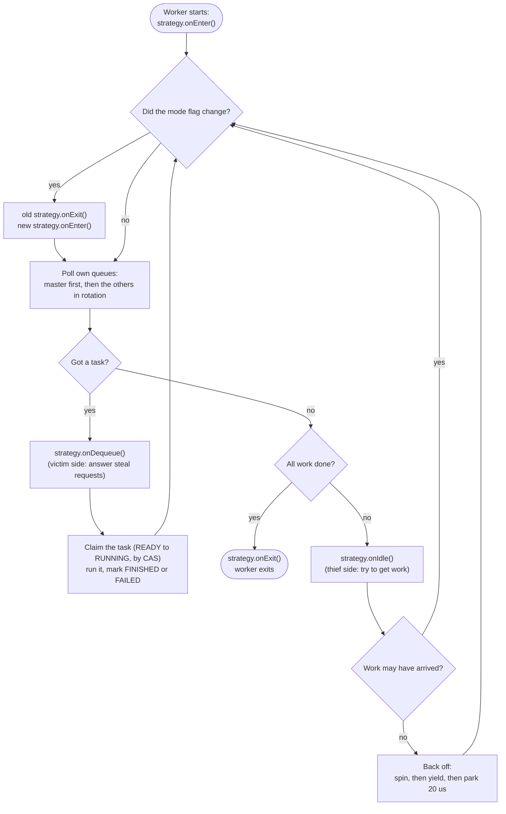

The mode flag is checked **only between tasks**, so a strategy is never switched while it is
in the middle of one of its own steps.

---

## 5. Spawning a task

What happens when a running task calls `ctx.spawn(child)`.

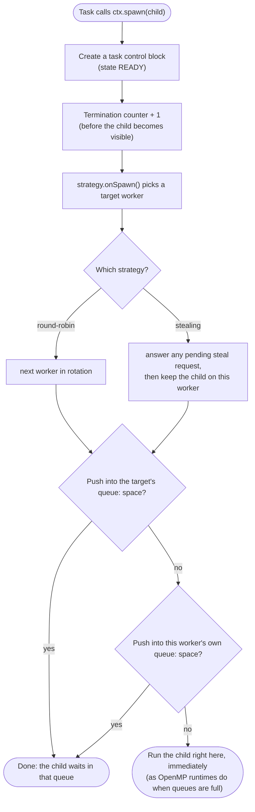

---

## 6. A task's life (task control block)

Every task has a task control block (TCB), like an OS process control block. Every state
change is a compare-and-set. If two workers ever tried to start the same task, the second CAS
would fail and be counted as a bug. Across every test and experiment run, that count is 0.

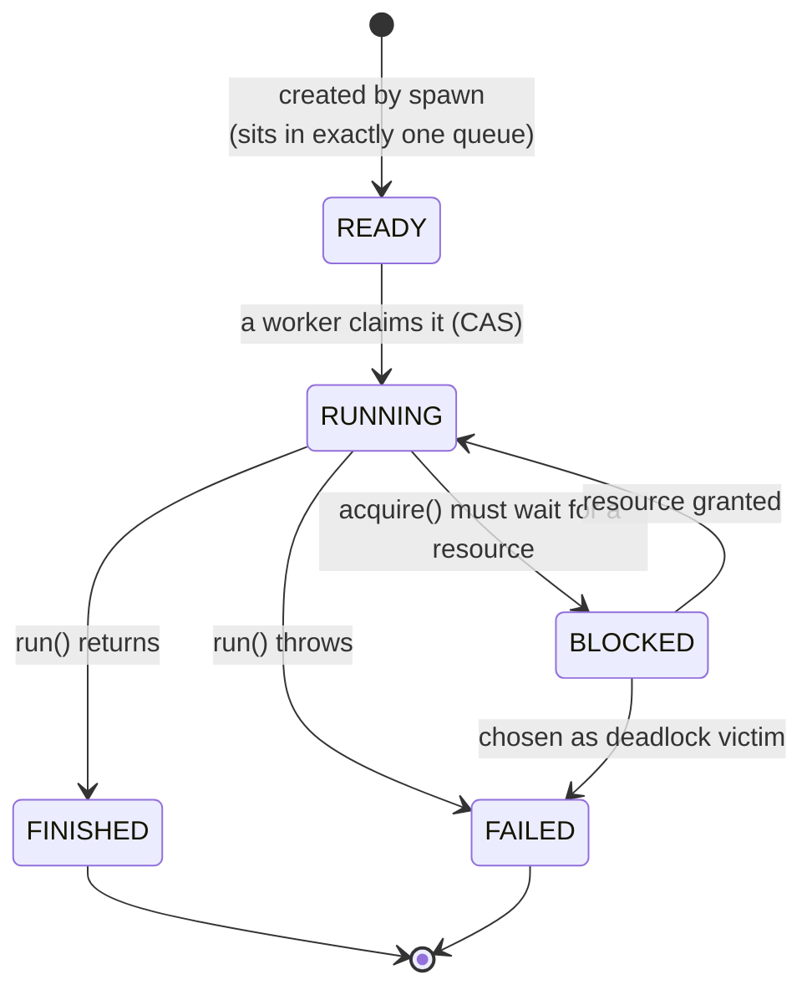

---

## 7. Work stealing: the handshake

An idle worker (the **thief**) never touches a busy worker's (the **victim**'s) queues.
It only *asks*, through one 64-bit word per victim: the steal-request cell, holding a round
number and the thief's id. The victim moves the task itself.

### The normal case

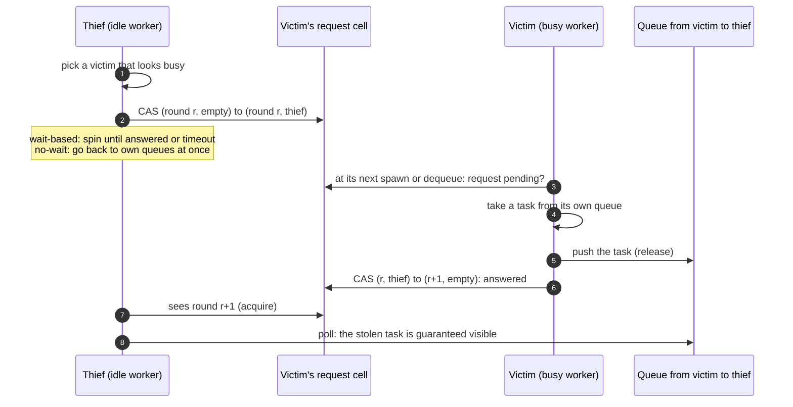

### When the thief gives up at the same moment the victim answers

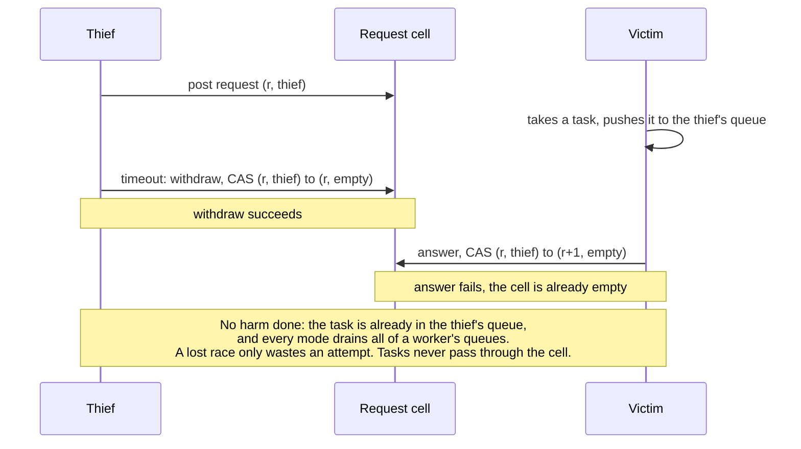

This exact race is tested with jcstress: it happened 5,000–32,000 times per run, and a task was
never lost or duplicated.

---

## 8. The adaptive controller

A separate monitor thread. Every 5 ms it samples the scheduler and decides whether to switch
strategy.

### The sampling loop

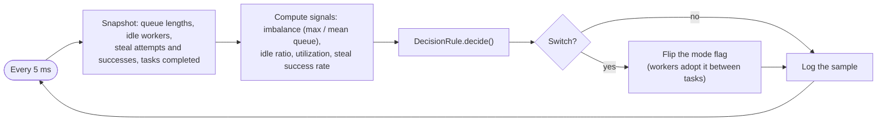

### How the decision rule thinks

Signals alone can mislead. In the shifting workload, round-robin looks bad after the shift,
but the paper's steal-1 is even worse there. So every switch is a **trial** that must prove
itself:

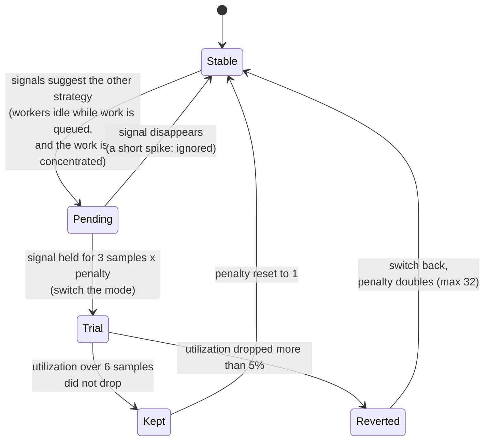

- **Hysteresis:** a condition must hold several samples in a row, and there's a minimum time
  between switches, so brief spikes never cause flapping.
- **Exponential backoff:** a strategy that keeps losing is tried less and less often.
- **Utilization** (the fraction of workers busy) is the judge, because it measures useful work
  regardless of task size.

### What it actually did on the shifting workload (8 workers, median run)

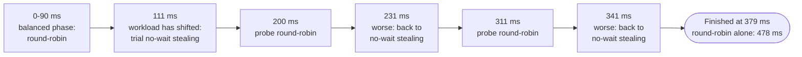

---

## 9. Why switching mid-run is safe

Workers notice a mode change at slightly different moments, so for a short while different
workers run different strategies. The diagram shows why no task can be lost:

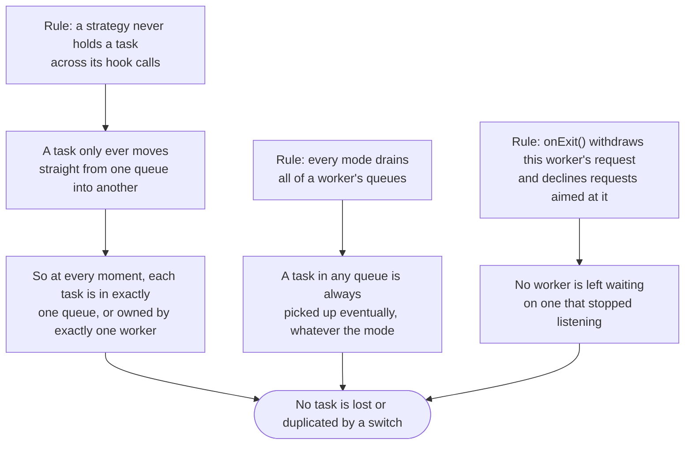

This is checked by the jcstress `ModeSwitchStress` tests (about 960 million samples, 0
forbidden outcomes) and by integration tests that flip the mode nonstop during runs.

---

## 10. Deadlock detection

Tasks can lock named resources (for example `fork-0`). The resource manager keeps a wait-for
graph and checks it on **every** request that would block.

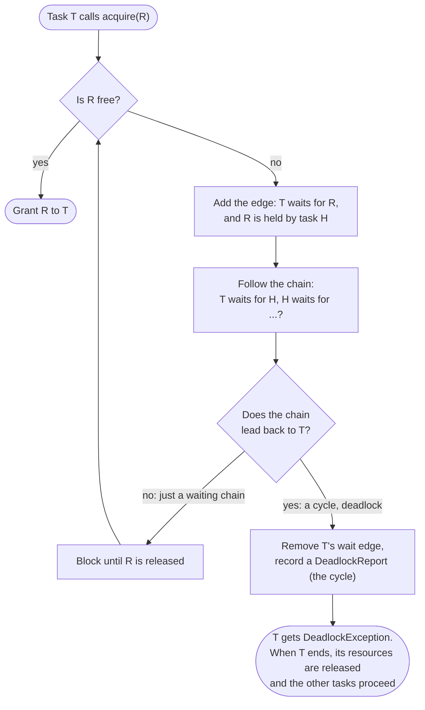

Why only the requester needs checking: a new cycle must include the new edge, so it always
passes through the task that just asked. In the dining-philosophers demo, 7–11 five-way
deadlocks per run were found this way and broken, and every meal was still eaten.

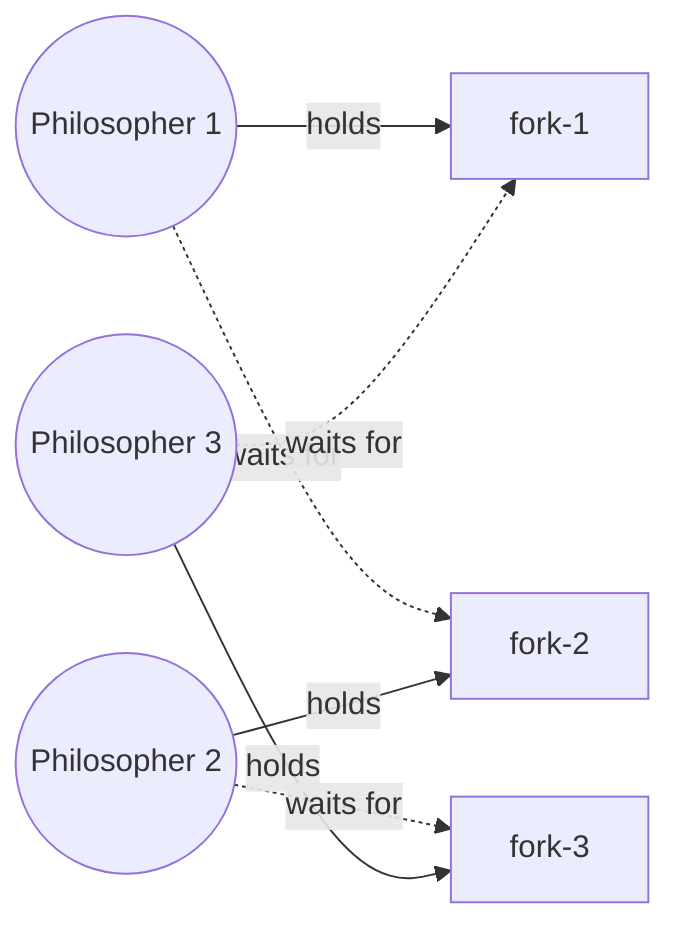

Above: a three-way cycle. Each philosopher holds one fork and waits for the next one, so
nobody can proceed. The last request that closes the loop is the one the detector rejects.

---

## 11. Knowing when everything is done

Tasks keep creating new tasks, so "all queues are empty" does not mean "finished": a running
task may be about to spawn more. The engine uses one counter instead:

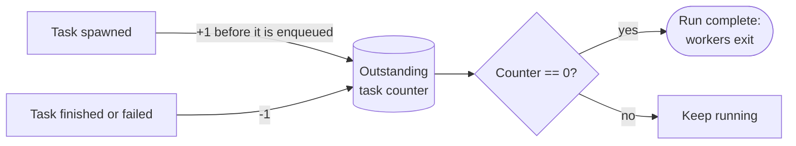

A child is always counted **before** its parent finishes, so the counter cannot reach zero
while any work exists. The integration tests check exactly this: a 300-step chain where only
one task exists at any moment, and a burst of work that arrives after 50 ms of everyone being
idle.

---

## 12. The experiment pipeline

How the numbers in the README are produced, so anyone can reproduce them.

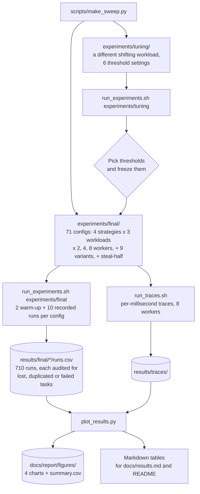

Tuning is kept separate from the final runs, so the reported numbers never come from the runs
the thresholds were tuned on.
